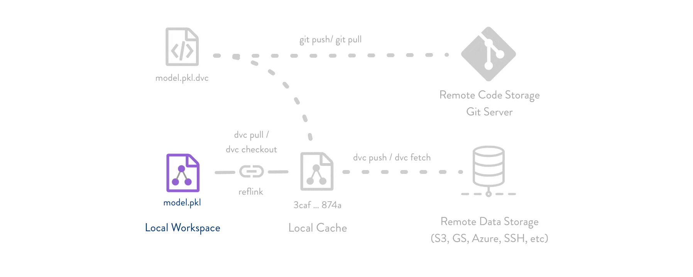

# Ad-campaign-performance

## **Objective**

To design a reliable hypothesis testing for the BIO service(service provided by the Ad company that quantifies the increase in brand awareness as a result of the ad) evaluate if a recent Ad campaign resulted in a significant lift in brand awareness.

## Background

SmartAd ran this Ad campaign from 3-10 July 2020. The users that were presented with the questionnaire above were chosen according to the following rule:

**Control**: users who have been shown a dummy ad

**Exposed**: users who have been shown a creative (ad) that was designed by SmartAd for the client.

## Data

The data is available for download [here](https://drive.google.com/file/d/1FVPOkNiQioJJ1A-NTy3YnoWYJZheCjPg/view?usp=sharing) and consists of the following columns

* auction_id: the unique id of the online user who has been presented the BIO. In standard terminologies this is called an impression id. The user may see the BIO questionnaire but choose not to respond. In that case both the yes and no columns are zero.
* experiment: which group the user belongs to - control or exposed.
* date: the date in YYYY-MM-DD format
* hour: the hour of the day in HH format.
* device_make: the name of the type of device the user has e.g. Samsung
* platform_os: the id of the OS the user has.
* browser: the name of the browser the user uses to see the BIO questionnaire.
* yes: 1 if the user chooses the “Yes” radio button for the BIO questionnaire.
* no: 1 if the user chooses the “No” radio button for the BIO questionnaire.

## Usage

Requirements: Docker

If you dont have Docker installed download from:[ https://docs.docker.com/get-docker/](https://github.com/Azariagmt/Telecom-Analysis/blob/main) for preferred OS

To get latest image from dockerhub use the command below

`docker pull 0941924816/ad-campaign-performance::latest`

Web Application can be found at:

# Continuous Machine Learning project integration with DVC

**[Data Version Control](https://github.com/iterative/dvc)** or **DVC** is an **open-source** tool for data science and machine learning projects. It allows for different versioning and management of datasets and Machine Learning models.

Using github actions we can actually generate ML results for every Pull request and have the info we need right there,

### DVC Command Cheat Sheet


```
git init
dvc init
git commit -m "initial commit"
```

#set dvc remote

```
dvc remote add -d myremote gdrive://0AIac4JZqHhKmUk9PDA/dvcstore
git commit -m "sets dvc remote"
```

#process which repeats after any modification of data(new version)

---

#adds file to dvc and .gitignore

```
dvc add path_to_data
git add .gitignore && path_to_data.dvc
git commit -m "data:track"
```

#tags data version on git

```
git tag -a 'v1' -m "raw data"
dvc push
```

---

go ahead and delete the data!
it might also appear in .dvc/cache

to get data back => dvc pull


## Conclusion

...